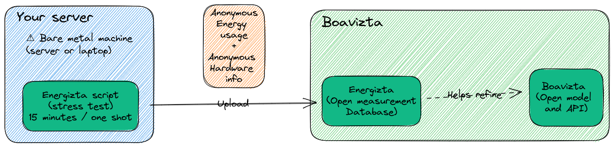

<p align="center">
    
</p>

<h3 align="center">
    Energizta is a collaborative project to collect and report open-data on the energy consumption of servers.
</h3>

---

**:warning: This is still a very early stage project. Any feedback or contribution will be highly appreciated. :warning:**



## What ❔

Science is still at an early stage for computer energy consumption evaluation. Several approaches have been used to measure (or model) the power consumption of computers (RAPL, IPMI, PDU, Models, Energy consumption metrology agents, Wattmeter, ...). These different methods have limitations in terms of completeness, confidence or implementability. Besides they often give different result on the same environment. 

So how do we bridge these gaps?

Energizta is trying to address these problems and provide a set of tools to report and model the power consumption of servers with as much precision as possible.

## How ❔

1. With a script that collect hardware configurations and retreive power consumption metrics on baremetal servers at differents states with differents methods. See [Energizta.sh 📡](./energizta).

2. With a "citizen science" database where anyone can contribute by uploading the information returned by the script. This database will be opendata and should allow research scientists to work on models and equations to describe power usage based upon hardware specs proxy metrics (realtime or average). See [data-mining 🔍](./data) & [api ☁️](./api).

3. With implementations of the potential findings in other projects.

## Quickstart for energita's data contributers 🚀

If you whant to quickly contribute to our data repository you can follow these steps.

### On Debian/Ubuntu
```bash
sudo apt-get install git awk sed curl lshw stress-ng
```

### Fedora/CentOS/Rocky/Alma
```bash
sudo dnf install git awk sed curl lshw stress-ng freeipmi ipmitool lm_sensors lsb_release  
```

```bash
wget https://raw.githubusercontent.com/Boavizta/Energizta/main/energizta/energizta.sh
chmod +x energizta.sh
sudo ./energizta.sh --stresstest --send-to-db
```

For more information see [Quickstart for energita's contributers 🚀](https://boavizta.github.io/Energizta/quickstart.html).

## Full documentation 📘

[Go to documentation 📘](https://boavizta.github.io/Energizta/)


## Other similar projets

 - Scaphandre : https://github.com/hubblo-org/scaphandre
 - PowerJoular : https://gitlab.com/joular/powerjoular
 - PowerAPI: https://github.com/powerapi-ng/
